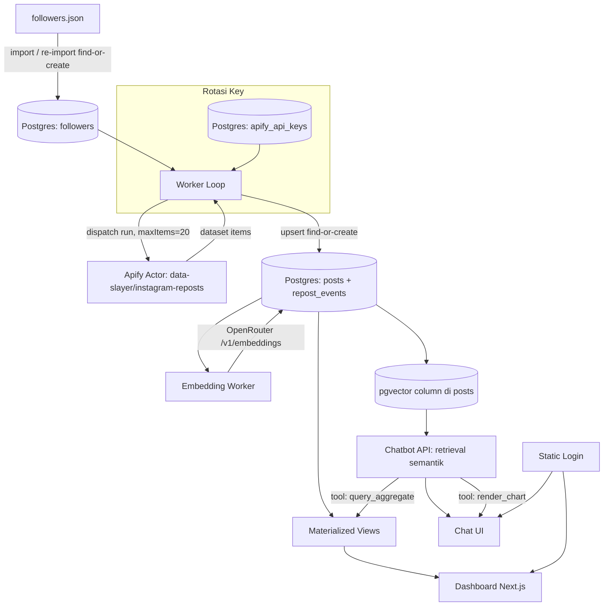

# RepostInsight — Software Requirements Specification (SRS)

| | |
|---|---|
| **Dokumen** | Software Requirements Specification |
| **Proyek** | RepostInsight |
| **Versi** | 1.1 (dipisah dari dokumen gabungan) |
| **Tanggal** | 24 September 2026 |
| **Pemilik** | Wahyu |

Rujukan bisnis: `BRD.md`. Rujukan scope produk: `PRD.md`. Struktur repo & tech stack: `PROJECT_STRUCTURE.md`. Urutan pengerjaan: `GRAND_PLAN.md`.

## 1. Pendahuluan

### 1.1 Tujuan Dokumen
Menyediakan spesifikasi teknis yang cukup detail untuk diimplementasikan langsung (termasuk oleh Claude Code sebagai coding agent) tanpa perlu keputusan arsitektur besar tambahan di tengah jalan.

### 1.2 Glossary

| Istilah | Arti |
|---|---|
| Follower | Akun Instagram yang mem-follow `wahy.all`, sumber scraping |
| Repost | Tindakan follower membagikan ulang post orang lain |
| Post | Konten Instagram original yang di-repost (dedup lintas follower) |
| Repost event | Catatan bahwa follower tertentu me-repost post tertentu |
| Worker | Proses Node.js terpisah yang menjalankan loop scraping & embedding |
| Find-or-create | Pola upsert: insert jika belum ada, update jika sudah ada, tanpa duplikat |

## 2. Gambaran Sistem & Arsitektur

Seluruh komponen berjalan lokal di satu laptop: aplikasi web (Next.js), proses worker (Node.js terpisah), dan database (Postgres + pgvector). Tidak ada komponen yang di-deploy ke server publik.



## 3. Functional Requirements

### F1 — Import & Manajemen Followers
- FR-1.1: Sistem membaca file `followers.json` (format export Instagram) dan mengekstrak `username` dari `string_list_data[].value`.
- FR-1.2: Saat import awal, setiap username baru dibuat sebagai baris `followers` dengan status `pending`.
- FR-1.3: Saat re-import, username yang sudah ada **tidak** direset statusnya (find-or-create by `username`); hanya username baru ditambahkan sebagai `pending`.
- FR-1.4: Sistem menampilkan ringkasan hasil re-import (jumlah followers baru, jumlah yang sudah ada sebelumnya).
- FR-1.5: File tidak valid (JSON rusak/struktur tidak sesuai) ditolak dengan pesan error eksplisit, tidak silent-fail.

### F2 — Mesin Scraping Resumable
- FR-2.1: Worker loop membaca `followers` berstatus `pending`, mengirim run ke Apify actor dengan `maxItems: 20` per follower.
- FR-2.2: Saat run di-dispatch, follower ditandai `in_progress` beserta `apify_run_id`.
- FR-2.3: Setiap start-up, worker merekonsiliasi follower `in_progress` dengan mengecek status run aktual via `GET /v2/actor-runs/{runId}` (run tetap berjalan di Apify meski laptop mati).
- FR-2.4: Tombol Pause mengubah `scrape_control.is_paused = true`; worker berhenti mendispatch batch baru tapi tidak membatalkan run yang sedang berjalan.
- FR-2.5: Tombol Resume mengubah `is_paused = false`; worker melanjutkan loop.
- FR-2.6: Concurrency dispatch dibatasi (default 2–3 run bersamaan), dapat dikonfigurasi lewat `scrape_control.max_concurrency`.
- FR-2.7: Follower dengan run `FAILED`/`ABORTED`/`TIMED-OUT` di-retry otomatis (`retry_count` bertambah) hingga batas maksimum (disarankan 3x), setelah itu ditandai `failed` permanen dan bisa di-retry manual dari UI.

### F3 — Manajemen Multi API-Key Apify
- FR-3.1: UI settings untuk menambah/menghapus/melabeli API key Apify.
- FR-3.2: Sistem berkala mengambil `GET /v2/users/me/limits` per key untuk mengetahui sisa kuota (`current.monthlyUsageUsd` vs `limits.maxMonthlyUsageUsd`) dan tanggal reset (`monthlyUsageCycle.endAt`).
- FR-3.3: Key dengan sisa kuota di bawah ambang batas (default 5% tersisa, dapat dikonfigurasi) tidak dipilih untuk dispatch baru (proactive rotation).
- FR-3.4: Jika dispatch tetap menerima HTTP `402 Payment Required`, key ditandai `exhausted` dan run yang gagal otomatis di-retry dengan key aktif berikutnya (bukan menandai follower gagal).
- FR-3.5: Jika API mengembalikan `401`/`403`, key ditandai `invalid` dan memerlukan koreksi manual.
- FR-3.6: Key berstatus `exhausted` yang melewati `usage_cycle_ends_at` otomatis dikembalikan ke `active` oleh proses berkala.
- FR-3.7: Jika seluruh key berstatus non-`active`, sistem otomatis men-set `scrape_control.is_paused = true` dengan `pause_reason = 'no_active_apify_keys'` dan menampilkan notifikasi di UI.

### F4 — Penyimpanan & Normalisasi Data
- FR-4.1: Setiap post dari hasil scraping disimpan/diperbarui di tabel `posts` menggunakan `id` (media ID Instagram) sebagai primary key.
- FR-4.2: Relasi follower-ke-post dicatat di tabel `repost_events` dengan constraint unik `(follower_username, post_id)`.
- FR-4.3: Re-scrape follower yang sama tidak menghasilkan duplikat — baris yang sudah ada di-*update* (`scraped_at`, `like_count`, dst), bukan di-insert ulang.
- FR-4.4: Payload mentah API disimpan penuh di kolom `raw_json` sebagai cadangan.

### F5 — Pipeline Embedding
- FR-5.1: Setiap post baru memiliki `embedding_status = 'pending'` secara default.
- FR-5.2: Proses embedding berjalan sebagai loop terpisah (pola sama seperti F2): ambil batch post `pending` (10–20 per siklus), panggil OpenRouter `/v1/embeddings` (model `nvidia/llama-nemotron-embed-vl-1b-v2:free`), simpan vector, tandai `done`.
- FR-5.3: Teks yang di-embed adalah gabungan `hashtags` + `visual_description` + `caption_text`. Model embedding ini punya konteks 131K token, jauh di atas kebutuhan realistis gabungan ketiganya, sehingga truncation praktis tidak akan pernah terpicu pada penggunaan normal. Tetap terapkan batas defensif (misal 8.000 karakter) untuk mencegah input pathological (caption yang sangat panjang di luar kewajaran) — jika batas ini benar-benar tersentuh, `caption_text` dipangkas lebih dulu karena `hashtags` dan `visual_description` sinyalnya lebih padat untuk retrieval.
- FR-5.4: Kegagalan (rate limit, error API) tidak mengubah status jadi `failed` permanen — tetap `pending` untuk dicoba ulang di siklus berikutnya, dengan exponential backoff.

### F6 — Chatbot RAG
- FR-6.1: Sistem mengklasifikasikan pertanyaan pengguna: kualitatif (retrieval semantik) atau analitik/statistik (query agregat).
- FR-6.2: Untuk pertanyaan kualitatif, sistem melakukan pencarian kemiripan vektor (pgvector) terhadap `posts.embedding` dan menyusun jawaban berbasis hasil retrieval.
- FR-6.3: Untuk pertanyaan analitik, chatbot memanggil tool yang menjalankan query terhadap *materialized view* agregat (bukan tabel mentah).
- FR-6.4: Chatbot dapat memanggil tool `render_chart` yang mengembalikan data terstruktur (label, value, jenis chart) untuk dirender sebagai grafik di UI.
- FR-6.5: Riwayat percakapan disimpan di tabel `chat_messages` agar konteks tidak hilang saat reload halaman.
- FR-6.6: LLM chat menggunakan OpenRouter Free Models Router (`openrouter/free`) atau model `:free` spesifik yang dipilih manual, dengan `tools` terdefinisi sesuai FR-6.3 dan FR-6.4.

### F7 — Dashboard Analitik
- FR-7.1: Dashboard menampilkan: top akun paling banyak di-repost, tren hashtag dari waktu ke waktu, aktivitas repost per hari/minggu.
- FR-7.2: Data dashboard bersumber dari *materialized view* yang di-refresh berkala, bukan query langsung ke tabel mentah tiap kali halaman dibuka.
- FR-7.3: Chart dashboard menggunakan Recharts.

### F8 — Autentikasi Statis
- FR-8.1: Seluruh halaman dilindungi satu kredensial statis (username + password), password di-hash (bcrypt), bukan plaintext.
- FR-8.2: Tidak ada fitur registrasi, reset password otomatis, atau manajemen banyak akun.

### F9 — Monitoring Internal
- FR-9.1: UI menampilkan ringkasan jumlah followers per status.
- FR-9.2: UI menampilkan status & sisa kuota tiap API key Apify.
- FR-9.3: UI menampilkan jumlah post dengan `embedding_status = pending` vs `done`.

### F10 — Deskripsi Visual Konten (Gambar & Video)
- FR-10.1: Post foto/carousel di-describe lewat vision model (1 panggilan per post), dengan caption asli disertakan sebagai konteks tambahan di prompt (bukan untuk diulang).
- FR-10.2: Post video di-describe lewat thumbnail/cover (1 panggilan) DITAMBAH 3-5 frame yang diekstrak merata dari durasi video, seluruhnya disertai konteks caption, lalu digabung jadi satu deskripsi lewat panggilan LLM tambahan.
- FR-10.3: Proses dijalankan segera setelah find-or-create post di siklus scraping yang sama (URL media Instagram kedaluwarsa dalam 1-2 hari).
- FR-10.4: `embedding_status` post di-reset ke `pending` setiap kali `visual_description` terisi/berubah, agar teks yang di-embed jadi caption + hashtag + deskripsi visual.

Spesifikasi lengkap (algoritma ekstraksi frame, prompt, kode) ada di `VISUAL_DESCRIPTION.md`.

## 4. Data Model

```sql
-- Daftar follower & status scraping
CREATE TABLE followers (
  username        text PRIMARY KEY,
  status          text NOT NULL DEFAULT 'pending', -- pending/in_progress/done/failed
  apify_run_id    text,
  last_scraped_at timestamptz,
  retry_count     int NOT NULL DEFAULT 0,
  created_at      timestamptz NOT NULL DEFAULT now()
);

-- Post original (dedup lintas follower yang repost post yang sama)
CREATE TABLE posts (
  id                text PRIMARY KEY,          -- IG media id
  code              text,
  owner_username    text,
  caption_text      text,
  hashtags          text[],
  media_type        text,
  like_count        int,
  play_count        int,
  taken_at          timestamptz,
  raw_json          jsonb,
  embedding         vector(1024),   -- dimensi model lokal qwen3-embedding:0.6b (Ollama)
  embedding_status  text NOT NULL DEFAULT 'pending', -- pending/done
  first_seen_at     timestamptz NOT NULL DEFAULT now(),
  last_updated_at   timestamptz NOT NULL DEFAULT now(),
  visual_description        text,               -- lihat VISUAL_DESCRIPTION.md (F10)
  visual_description_status text NOT NULL DEFAULT 'pending' -- pending/done/failed/skipped
);

-- Relasi many-to-many: follower mana me-repost post apa
CREATE TABLE repost_events (
  id                serial PRIMARY KEY,
  follower_username text NOT NULL REFERENCES followers(username),
  post_id           text NOT NULL REFERENCES posts(id),
  scraped_at        timestamptz NOT NULL DEFAULT now(),
  UNIQUE (follower_username, post_id)
);

-- Manajemen multi API-key Apify
CREATE TABLE apify_api_keys (
  id                    serial PRIMARY KEY,
  label                 text,
  token                 text NOT NULL,
  status                text NOT NULL DEFAULT 'active', -- active/exhausted/invalid
  monthly_usage_usd     numeric,
  max_monthly_usage_usd numeric,
  usage_cycle_ends_at   timestamptz,
  last_checked_at       timestamptz,
  last_used_at          timestamptz,
  created_at            timestamptz NOT NULL DEFAULT now()
);

-- Kontrol global worker (single row)
CREATE TABLE scrape_control (
  id              int PRIMARY KEY DEFAULT 1,
  is_paused       boolean NOT NULL DEFAULT false,
  pause_reason    text,
  max_concurrency int NOT NULL DEFAULT 3
);

-- Riwayat chat
CREATE TABLE chat_messages (
  id          serial PRIMARY KEY,
  role        text NOT NULL,        -- user/assistant/tool
  content     text,
  tool_calls  jsonb,
  created_at  timestamptz NOT NULL DEFAULT now()
);
```

**Indeks**: tambahkan index pgvector (`ivfflat` atau `hnsw`) pada `posts.embedding` bila pencarian brute-force mulai terasa lambat (perkiraan aman tanpa index hingga puluhan ribu baris pada hardware yang tersedia). Tambahkan index biasa pada `repost_events.post_id` dan `repost_events.follower_username` untuk mempercepat agregasi dashboard.

## 5. Spesifikasi Integrasi Eksternal

| Integrasi | Endpoint | Catatan |
|---|---|---|
| Apify — jalankan actor | `POST /v2/actor-runs?token=...` (actor `data-slayer~instagram-reposts`) | Body: `{ "username": "<follower>" }`, plus `maxItems: 20` di run options |
| Apify — cek status run | `GET /v2/actor-runs/{runId}` | Dipakai untuk rekonsiliasi (FR-2.3) |
| Apify — ambil hasil | `GET /v2/datasets/{datasetId}/items` | Setelah run `SUCCEEDED` |
| Apify — cek kuota akun | `GET /v2/users/me/limits` | Dipakai per key untuk rotasi proaktif (FR-3.2) — respons berisi `monthlyUsageCycle`, `limits`, `current` |
| OpenRouter — embedding | `POST /v1/embeddings`, model `nvidia/llama-nemotron-embed-vl-1b-v2:free` | Konteks 131K token, output 2048 dimensi. Model ini juga mendukung input gambar (`content` array dengan `image_url`), tapi untuk Opsi A dipakai murni sebagai text embedder — lihat `VISUAL_DESCRIPTION.md` untuk kemungkinan pemakaian multimodalnya di kemudian hari |
| OpenRouter — chat + tools | `POST /v1/chat/completions`, model `openrouter/free` (atau model `:free` spesifik) | Harus mendukung parameter `tools` |

## 6. Spesifikasi API Internal (Next.js Route Handlers)

| Method & Path | Fungsi | Terkait FR |
|---|---|---|
| `POST /api/followers/import` | Upload/re-import `followers.json` | FR-1.1–1.5 |
| `GET /api/followers?status=` | Daftar followers difilter status | FR-9.1 |
| `POST /api/followers/:username/retry` | Retry manual follower `failed` | FR-2.7 |
| `POST /api/scrape-control/pause` | Set `is_paused = true` | FR-2.4 |
| `POST /api/scrape-control/resume` | Set `is_paused = false` | FR-2.5 |
| `GET /api/apify-keys` | Daftar key & status/kuota | FR-9.2 |
| `POST /api/apify-keys` | Tambah key baru | FR-3.1 |
| `DELETE /api/apify-keys/:id` | Hapus key | FR-3.1 |
| `GET /api/dashboard/summary` | Data agregat untuk dashboard | FR-7.1–7.2 |
| `POST /api/chat` | Kirim pesan ke chatbot (streaming) | FR-6.1–6.6 |
| `GET /api/chat/history` | Ambil riwayat percakapan | FR-6.5 |

## 7. Non-Functional Requirements

| Kategori | Requirement |
|---|---|
| **Reliabilitas** | Semua proses background (scraping, embedding) idempotent & resumable — aman dihentikan paksa kapan saja tanpa kehilangan/menduplikasi data |
| **Kinerja** | UI dashboard & chat tetap responsif meski worker berjalan di background pada RAM 8GB |
| **Keamanan** | Password login di-hash (bcrypt); API key Apify & OpenRouter tidak boleh ter-commit ke version control |
| **Skalabilitas** | Dirancang untuk skala tunggal: 1 laptop, ±10.000–15.000 followers, bukan multi-tenant |
| **Retensi data** | Data disimpan selamanya (tanpa auto-purge) — pertumbuhan disk perlu dipantau manual |
| **Maintainability** | Skema database terdokumentasi via Prisma; struktur monorepo memisahkan concern web/worker/db |

## 8. Lingkungan & Infrastruktur

Hardware yang tersedia: **Windows, Intel i5 generasi ke-7, RAM 8GB** — kelas menengah-bawah, sehingga beberapa keputusan desain sengaja konservatif:

- **Database**: Postgres + pgvector via Docker (image `pgvector/pgvector:pg16`), bukan native install (kompilasi pgvector di Windows native merepotkan). Jika pakai Docker Desktop/WSL2, batasi resource lewat `.wslconfig` (`memory=3GB`, `processors=2`).
- **Aplikasi Next.js**: mode production (`next build && next start`) untuk pemakaian sehari-hari, bukan `next dev`.
- **Worker**: satu proses Node.js tunggal, tanpa Redis/BullMQ — antrean berbasis kolom status di Postgres.
- **Concurrency dispatch Apify**: default 2–3 run bersamaan.
- **Batch embedding**: 10–20 post per siklus, sesuai rate limit tier gratis OpenRouter.

## 9. Autentikasi & Keamanan

Login statis single-user menggunakan NextAuth (Credentials Provider): satu username & password (di-hash) disimpan di environment variable/tabel sederhana. Middleware melindungi seluruh route aplikasi — tidak ada halaman publik. Token Apify/OpenRouter disimpan di database (tabel `apify_api_keys` untuk Apify; env var untuk OpenRouter), tidak pernah di-commit ke version control.

## 10. Strategi Pengujian

Tidak ada automated testing/CI (keputusan pemilik proyek). Checklist manual minimal:

| Area | Skenario yang perlu dicek manual |
|---|---|
| Import followers | File valid, username duplikat, file kosong/rusak |
| Worker scraping | Pause di tengah proses, paksa-matikan lalu nyalakan ulang → pastikan rekonsiliasi bekerja |
| Rotasi API key | Tandai satu key `exhausted` manual → pastikan worker pindah ke key lain |
| Re-import followers | Import ulang dengan sebagian username sama, sebagian baru → status lama tidak ter-reset |
| Find-or-create posts | Scrape ulang follower yang sama → tidak ada baris duplikat di `repost_events` |
| Chatbot | Pertanyaan kualitatif vs statistik → tool yang tepat terpanggil; minta grafik → render chart, bukan teks |
| Dashboard | Data dashboard konsisten dengan data mentah setelah materialized view refresh |

## 11. Error Handling & Logging

- Semua pemanggilan API eksternal (Apify, OpenRouter) dibungkus try/catch dengan pencatatan error minimal (timestamp, endpoint, status code) — tidak perlu sistem logging terpusat, cukup console/log file lokal mengingat skala single-user.
- Kegagalan sementara (rate limit, network) tidak boleh mengubah status jadi `failed` permanen — hanya kegagalan berulang melewati `retry_count` maksimum yang final.
- Error di UI (misal API key gagal ditambahkan) ditampilkan sebagai pesan jelas, bukan generic "terjadi kesalahan".

## 12. Asumsi & Batasan Teknis

- Kapasitas disk laptop tidak dispesifikasikan — diasumsikan mencukupi untuk pertumbuhan data jangka menengah; perlu dipantau manual mengingat retensi data selamanya.
- Jumlah maksimum run bersamaan yang diizinkan tiap akun Apify (tergantung plan) belum diverifikasi — perlu dicek langsung sebelum finalisasi `max_concurrency`.
- Ketersediaan model gratis di OpenRouter dapat berubah — nama model dibaca dari konfigurasi/env, bukan hardcode.
- **Migrasi model embedding**: sistem awalnya dibangun dengan `liquid/lfm-2.5-embedding-350m:free` (1024 dimensi), lalu dipindah ke `nvidia/llama-nemotron-embed-vl-1b-v2:free` (2048 dimensi) setelah go-live. Karena dimensi vektor berubah, migrasi ini mewajibkan `ALTER COLUMN`/recreate kolom `embedding` ke `vector(2048)` dan reset `embedding_status = 'pending'` untuk **seluruh** post yang sudah ada agar di-embed ulang — vektor dari dua model berbeda tidak boleh dicampur dalam satu kolom.
- Endpoint `nvidia/llama-nemotron-embed-vl-1b-v2:free` berstatus trial di OpenRouter: prompt & output di-log oleh provider untuk pengembangan model mereka. Diterima sebagai risiko dalam kategori yang sama dengan asumsi A3 di `BRD.md` (kebijakan tier gratis bisa berubah sewaktu-waktu), bukan aspek yang ditangani khusus di luar itu.
